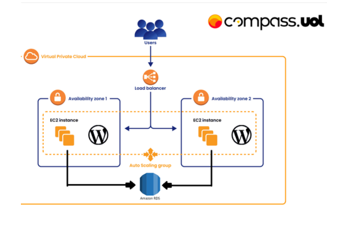

### 🚀 Atividade 2 Docker PB - NOV 2024 Turma DevSecOps

# 🏗️ Projeto Terraform para Infraestrutura AWS

## 📌 Índice

1. 📖 [Descrição](#descrição)
2. 🏢 [Arquitetura de Alta Disponibilidade](#arquitetura-de-alta-disponibilidade)
3. ⚙️ [Pré-requisitos](#pré-requisitos)
4. 📥 [Instalação](#instalação)
5. 🔧 [Configuração](#configuração)
6. 🚀 [Uso](#uso)
7. 🏗️ [Arquitetura](#arquitetura)
8. 🔍 [Recursos Provisionados](#recursos-provisionados)
9. 📈 [Melhorias](#melhorias)
   - 📊 [Monitoramento](#monitoramento)
   - 🛠️ [Modularização](#modularização)
   - 🔄 [Recurso Data](#recurso-data)

## 📖 Descrição

Este projeto foi desenvolvido com o objetivo de criar uma infraestrutura robusta e escalável na AWS, garantindo alta disponibilidade para a aplicação WordPress. Utilizando uma combinação de tecnologias modernas, conseguimos proporcionar uma solução eficiente e resiliente, capaz de atender a demandas variáveis de tráfego e garantir a continuidade do serviço.

Decidimos utilizar Terraform para provisionar uma infraestrutura na AWS, uma ferramenta muito conhecida e com uma documentação muito abrangente. Infraestrutura como código (IaC) que permite o provisionamento e o gerenciamento de recursos de infraestrutura de maneira declarativa e automatizada.

## 🏢 Arquitetura de Alta Disponibilidade

- **🌍 Multi-AZ Deployment**: Recursos distribuídos em múltiplas zonas de disponibilidade (AZs) para garantir redundância e tolerância a falhas.
- **📈 Auto Scaling**: Ajuste automático da capacidade de computação com base na demanda, garantindo que a aplicação possa lidar com picos de tráfego sem interrupções.
- **⚖️ Load Balancing**: Distribuição eficiente do tráfego de rede entre as instâncias EC2, assegurando que nenhuma instância fique sobrecarregada.

## ⚙️ Pré-requisitos

- 🔽 Instale o [Terraform](https://www.terraform.io/downloads.html) v1.10.5 ou superior
- ☁️ Conta AWS com permissões adequadas
- 🔑 Chave SSH para acesso às instâncias EC2

## 📥 Instalação

1. 📂 Clone o repositório:
    ```sh
    git clone https://github.com/JoaoGSantiago/CompassUolProjetoDocker.git
    cd Compass-PB-NOV2024-Docker
    ```

2. 🛠️ Inicialize o Terraform:
    ```sh
    terraform init
    ```

## 🔧 Configuração

1. 📝 Crie um arquivo `terraform.tfvars` com as variáveis necessárias:
    ```ini
    aws_access_key = "sua_chave_de_acesso"
    aws_secret_key = "sua_chave_secreta"
    region         = "us-east-1"
    ```

## 🚀 Uso

1. 🔍 Planeje a infraestrutura:
    ```sh
    terraform plan
    ```

2. ▶️ Aplique a infraestrutura:
    ```sh
    terraform apply -auto-approve
    ```

## 🏗️ Arquitetura



## 🔍 Recursos Provisionados

- **🌐 VPC**: Rede virtual para isolar a infraestrutura.
- **📦 Subnets**: Sub-redes públicas e privadas.
- **🔒 Security Groups**: Controle de acesso para os recursos.
- **🖥️ EC2 Instances**: Instâncias para hospedar o WordPress.
- **📊 Auto Scaling Group**: Escalonamento automático das instâncias.
- **⚖️ Elastic Load Balancer**: Distribuição de tráfego.
- **💾 RDS**: Banco de dados relacional para o WordPress.
- **📁 EFS**: Sistema de arquivos para armazenamento compartilhado.

## 📈 Melhorias

### 📊 Monitoramento

🛠️ Implementar um sistema de monitoramento robusto utilizando Prometheus e Grafana para garantir a observabilidade da aplicação. Com o Prometheus, é possível coletar métricas detalhadas sobre o desempenho e a saúde dos componentes da infraestrutura. O Grafana, por sua vez, permite a criação de dashboards interativos e visualizações personalizadas, facilitando a análise e a identificação de possíveis problemas.

### 🛠️ Modularização

🔄 Refatorar o código Terraform para utilizar módulos. A criação de módulos permitirá a reutilização de componentes de infraestrutura em diferentes projetos, facilitando a manutenção e a escalabilidade do código.

### 🔄 Recurso Data

📌 Utilizar o recurso `data` do Terraform para obter informações sobre recursos existentes na AWS. Isso permitirá que o código seja mais dinâmico e adaptável a diferentes ambientes, sem a necessidade de hardcoding de valores.

